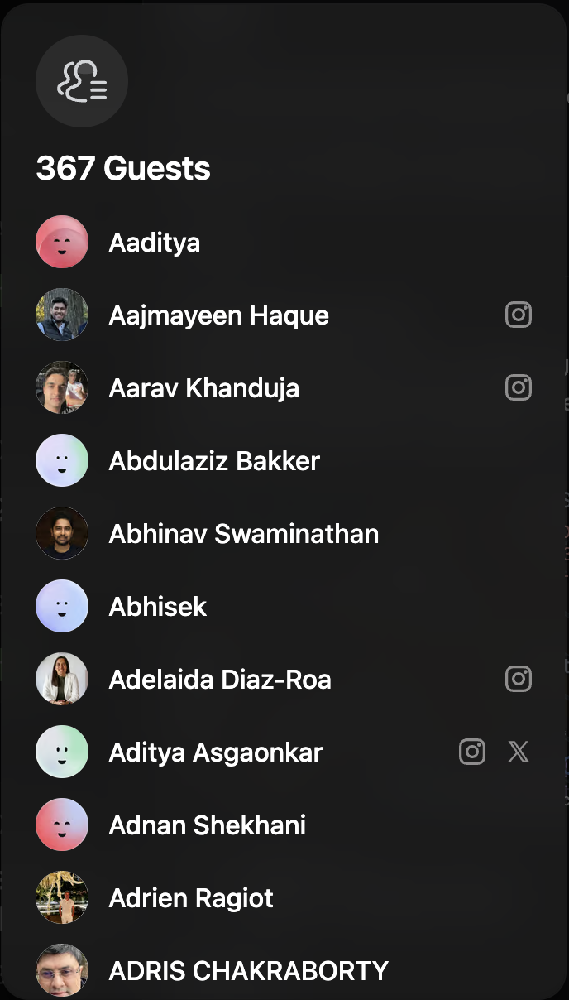
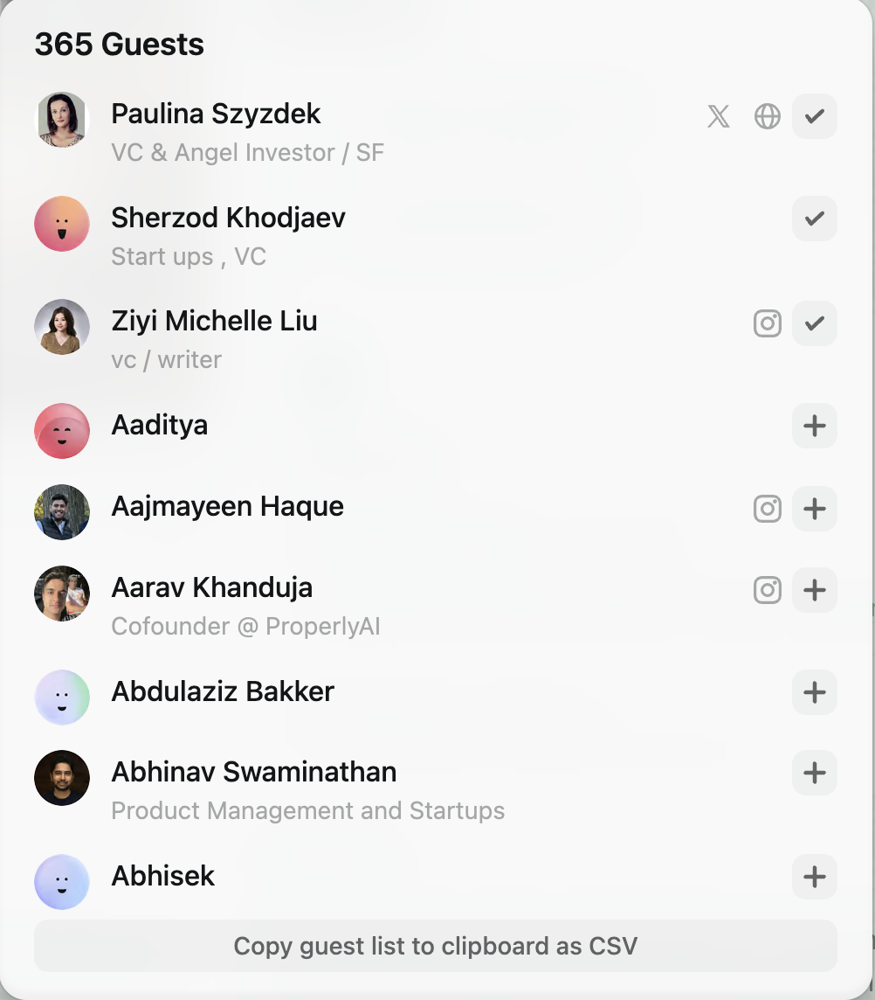

# Better Luma Chrome Extension

[Luma](https://lu.ma) is a website for hosting events.
I sometimes look through the guest list to see if there's anyone in particular I want to
talk to, but there's often hundreds of people to sift through.

This extension makes things easier by:
* showing additional information in the guest list that you normally would have to click on their profile for
* allowing you to favorite people, showing them at the top of all guest lists
* export the guest list as CSV

> [!IMPORTANT]
> You need to be on the actual event page to use this feature. You can't just be on the side panel on the home or discover page.

| Default Guest List | New Guest List |
|:----------:|:------:|
|  |  |
